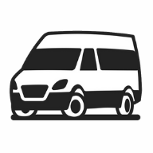

<h1 align="center">
    
</h1>

<h4 align="center">
  🚀 Fly Van
</h4>

  <a href="#rocket-tecnologias">Tecnologias</a>&nbsp;&nbsp;&nbsp;|&nbsp;&nbsp;&nbsp;
  <a href="#-projeto">Projeto</a>&nbsp;&nbsp;&nbsp;|&nbsp;&nbsp;&nbsp;
  <a href="#-video-do-projeto">Video</a>&nbsp;&nbsp;&nbsp;|&nbsp;&nbsp;&nbsp;
  <a href="#-contato">Contato</a>

 

  

## :rocket: Tecnologias

Esse projeto foi desenvolvido utilizando:

- [Node.js](https://nodejs.org/en/)
- [Express](https://expressjs.com/pt-br/)
- [Sequelize](https://sequelize.org/v5/)
- [MySQL](https://www.mysql.com/)
- [Socket.io](https://socket.io/docs)

## 💻 Projeto

Um app pra fretamento de van, e tbm rastreamento das vans

---

Feito com ♥ by Natan Bezerra de Miranda, Matheus Penchiari, Pedro Gambirazi e Abner Almeida :wave: